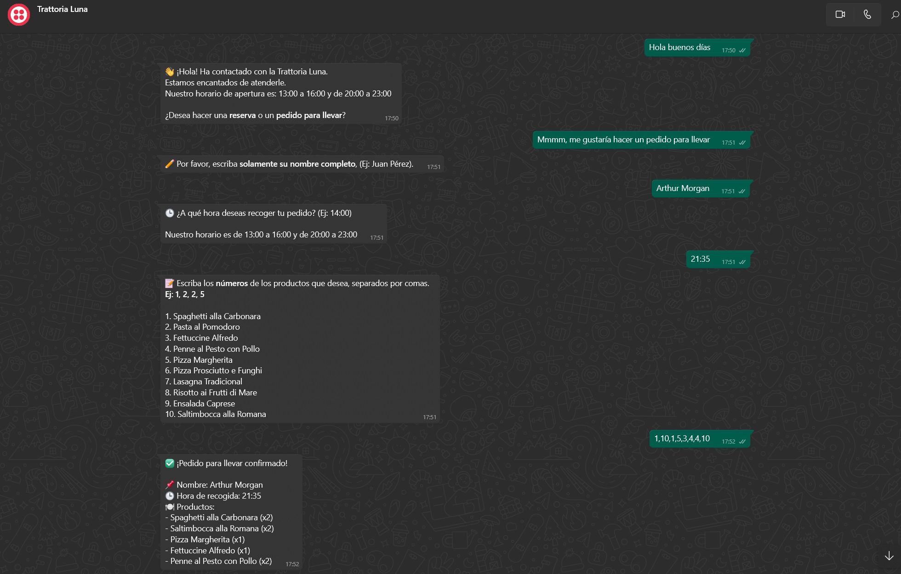
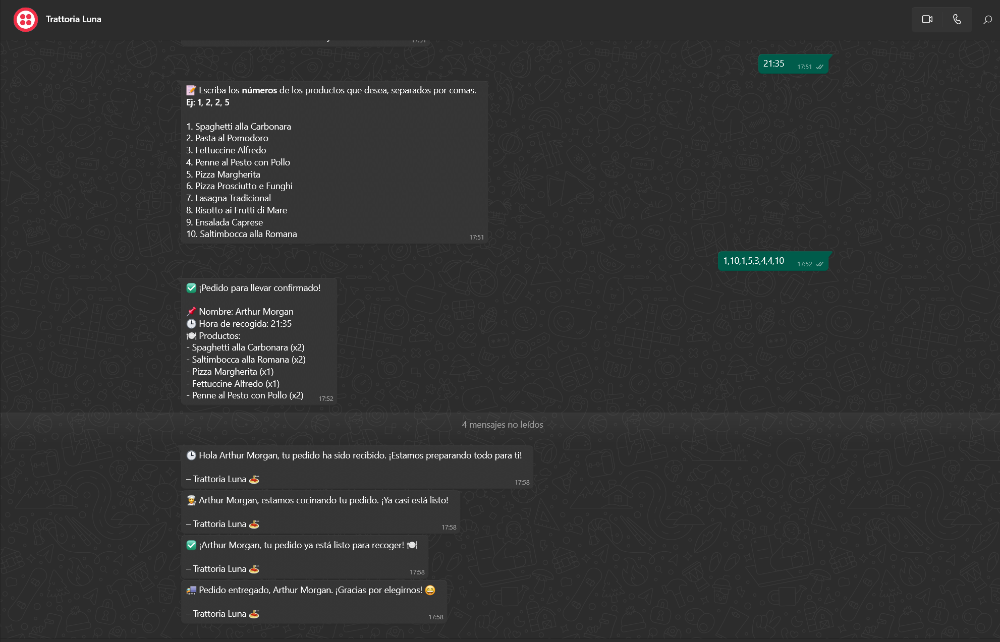
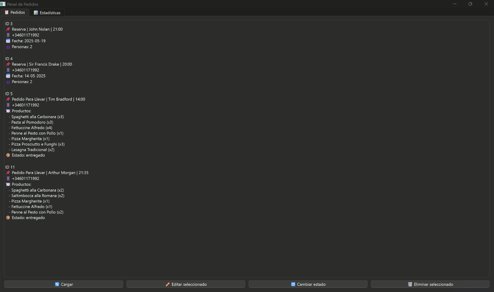
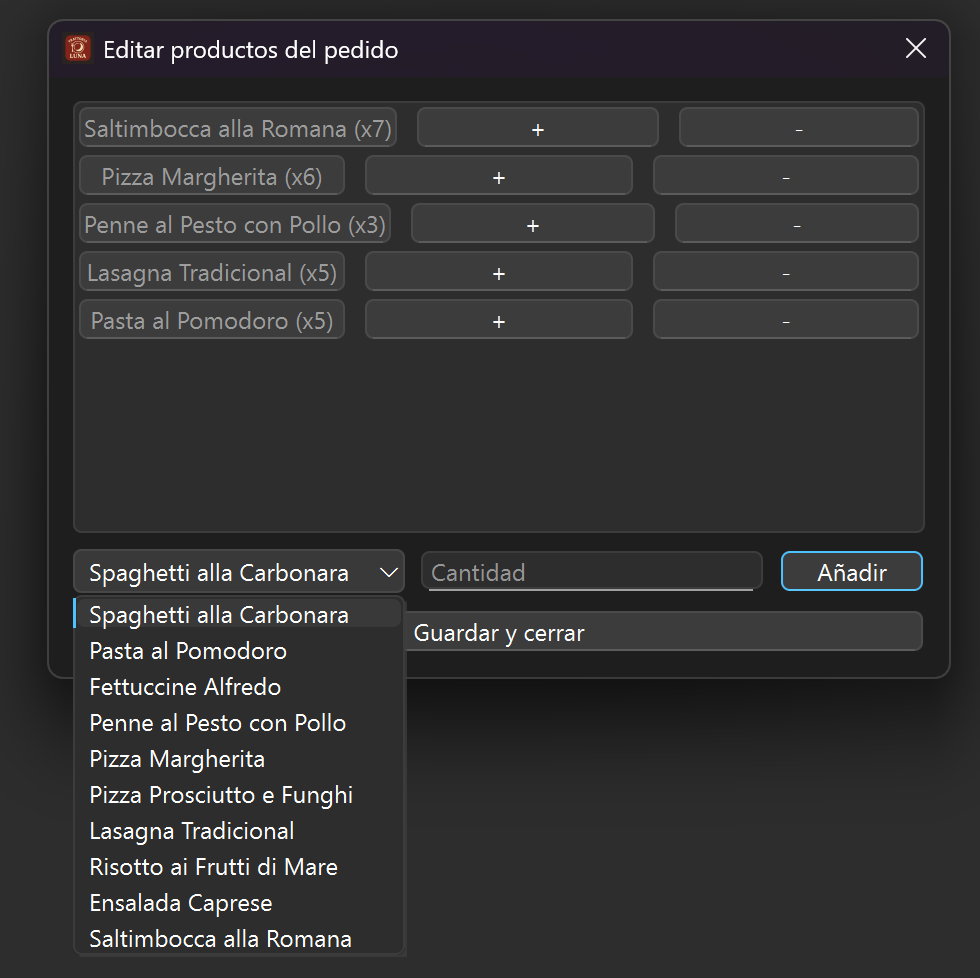
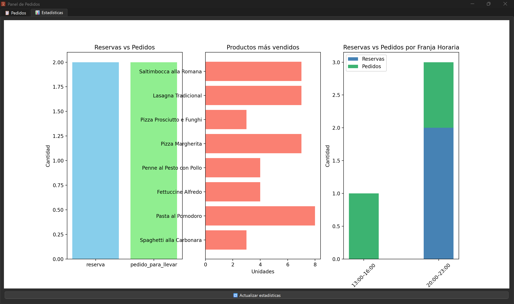

# 🍝 Trattoria Luna

**Trattoria Luna** es una aplicación de escritorio desarrollada por **Francisco Luna Raya** como parte de su Trabajo de Fin de Grado (TFG). Este proyecto proporciona una solución completa para la gestión de **pedidos para llevar** y **reservas** en un restaurante italiano, con integración vía WhatsApp y un panel de control para PC en la que el restaurante podrá gestionar todos los pedidos entrantes.

---

## 🧩 Estructura del proyecto

```
TFG/
├── backend/            # API Flask desplegada en Render (gestiona los pedidos y WhatsApp)
│   ├── app.py
│   └── requirements.txt
├── crud_app/           # Aplicación PySide6 (aplicación de escritorio para restaurante)
│   ├── panel_pedidos.py
│   └── Notificacion.wav
├── resources/          # Iconos e imágenes para documentación
│   ├── icon.ico
│   ├── App_Pedidos.png
│   ├── Flujo_Pedido1.png
│   ├── Flujo_Pedido2.png
│   ├── Editar_Productos.png
│   └── Ventana_Estadisticas.png
└── README.md
```

---

## 🚀 Tecnologías utilizadas

- **Python 3**
- **Flask** (backend)
- **MongoDB Atlas** (base de datos en la nube)
- **PySide6** (interfaz gráfica de escritorio)
- **Twilio API** (mensajes automáticos por WhatsApp)
- **Matplotlib + NumPy** (gráficas)
- **Render** (hosting del backend Flask)

---

## 📸 Capturas de pantalla
###
### 💬 Chatbot de WhatsApp automático
#### ✅ Confirmación de pedido + mensajes automáticos
#### 🧭 Flujo de pedido paso a paso



### 🖥️ Panel CRUD con pedidos y reservas
#### 🖼️ Vista de la ventana de pedidos

#### 🖼️ Vista de la ventana de edición de productos

#### 📊 Vista de la ventana de estadísticas visuales


---

## ⚙️ Cómo ejecutar el proyecto

### 1. Clonar el repositorio

```bash
git clone https://github.com/Fluna29/TFG.git
cd TFG
```

### 2. Crear y activar entorno virtual

```bash
python -m venv .venv
# En Windows:
.venv\Scripts\activate
# En macOS/Linux:
source .venv/bin/activate
```

### 3. Instalar dependencias necesarias

```bash
pip install PySide6 matplotlib numpy requests playsound
```

(O bien instala las dependencias del backend si vas a ejecutarlo localmente)

---

## 📡 Chatbot de WhatsApp (backend)

Si deseas probar el backend localmente en lugar de Render:

1. Entra en la carpeta `backend/`.
2. Instala los paquetes desde `requirements.txt`.
3. Crea un archivo `.env` con las variables necesarias (`MONGO_URI`, `TWILIO_AUTH_TOKEN`, etc.).
4. Ejecuta:

```bash
python app.py
```

---

## 🖥️ Aplicación de escritorio restaurante (frontend)

1. Entra en la carpeta `crud_app/`.
2. Ejecuta el panel con:

```bash
python panel_pedidos.py
```

Esto abrirá la aplicación de escritorio con:

- Visualización y edición de pedidos y reservas
- Estadísticas visuales
- Sonido de notificación
- Integración automática con backend en Render

---

## 👨‍💻 Autor

- **Nombre:** Francisco Luna Raya  
- **GitHub:** [Fluna29](https://github.com/Fluna29)

---

🎓 Proyecto de Fin de Grado – 2025  
IES Los Albares, Cieza, Región de Murcia, España